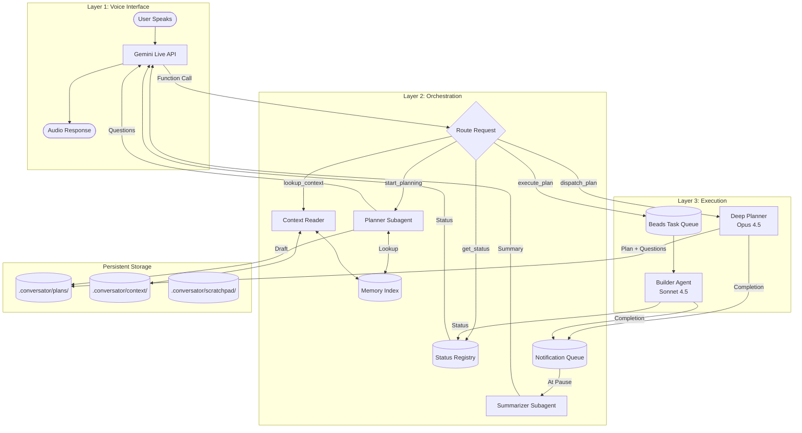
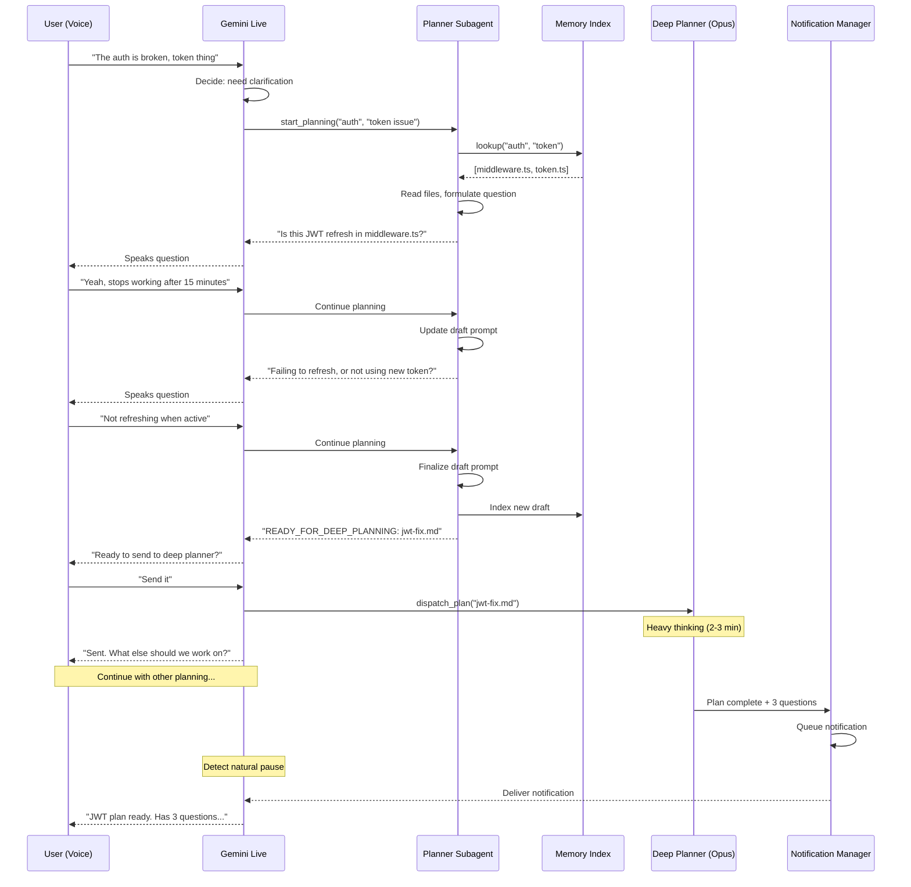
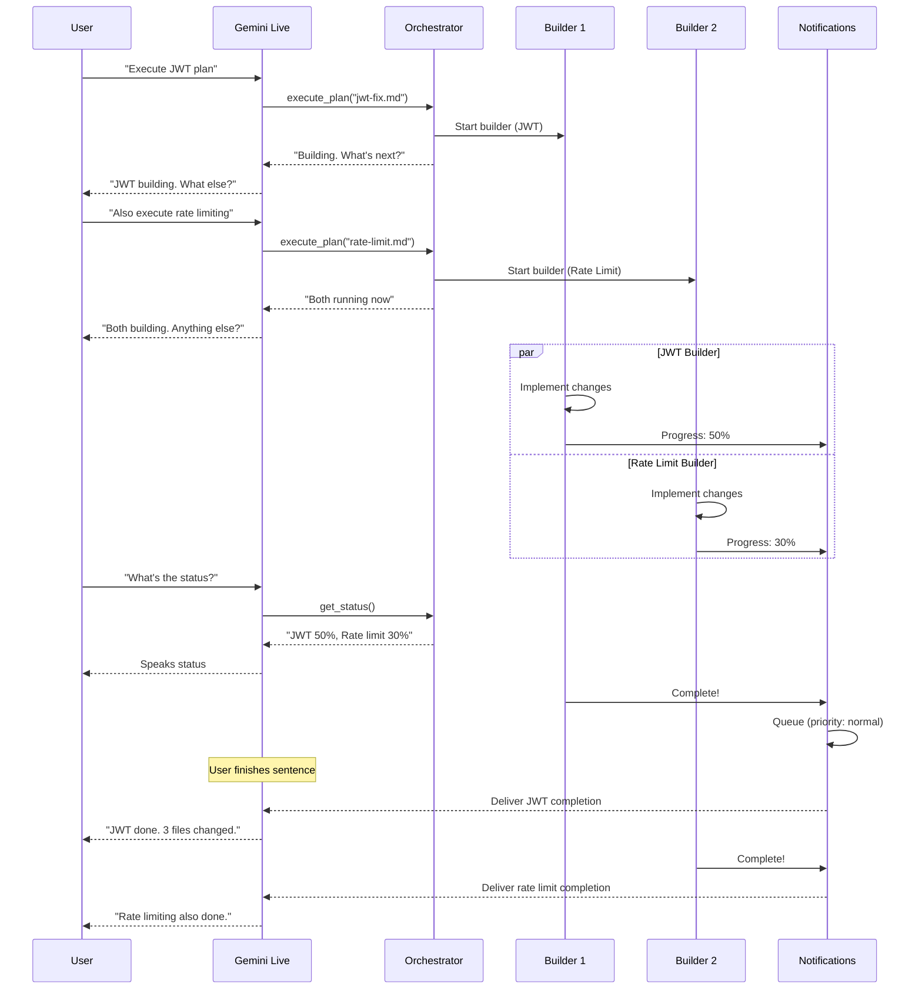
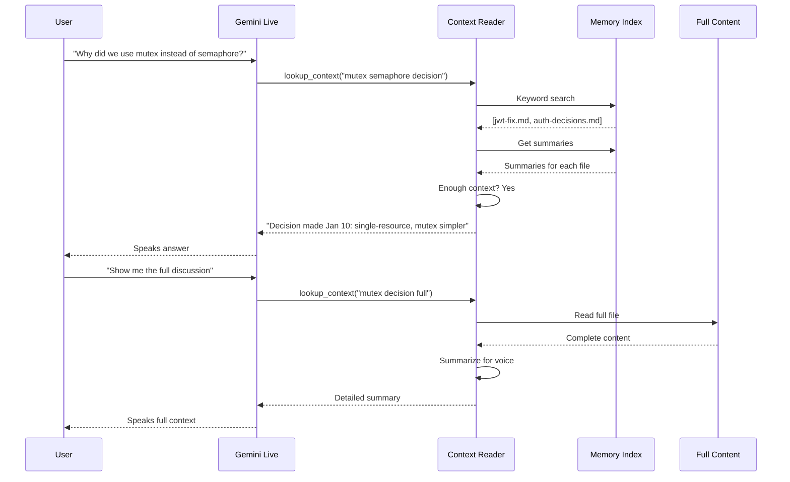

# Conversator: Product Requirements Document (PRD)

**Version:** 1.0  
**Date:** January 12, 2026  
**Author:** Logan / Claude  
**Status:** Draft - Planning Phase

---

## Table of Contents

1. [Executive Summary](#1-executive-summary)
2. [Problem Statement](#2-problem-statement)
3. [Product Vision](#3-product-vision)
4. [Technical Architecture](#4-technical-architecture)
5. [Core Components Deep Dive](#5-core-components-deep-dive)
6. [Context Management System](#6-context-management-system)
7. [Workflow & Process Flows](#7-workflow--process-flows)
8. [Technology Decisions & Rationale](#8-technology-decisions--rationale)
9. [Implementation Phases](#9-implementation-phases)
10. [Cost Analysis](#10-cost-analysis)
11. [Risk Assessment](#11-risk-assessment)
12. [Success Metrics](#12-success-metrics)
13. [Appendices](#13-appendices)

---

## 1. Executive Summary

### 1.1 What is Conversator?

Conversator is a **voice-first orchestration layer** that enables hands-free software development through natural conversation. It sits between the developer (speaking naturally) and multiple AI coding agents (Claude Code, OpenCode, etc.), transforming vague verbal requests into refined, high-quality prompts through iterative dialogue.

### 1.2 Core Value Proposition

**Current State:** Developers type detailed prompts to coding agents, wait for results, iterate manually, and context-switch constantly between tasks.

**Future State:** Developers speak casually about what they need, Conversator asks clarifying questions, refines the request into an optimized prompt, dispatches to appropriate agents, monitors progress, and keeps the developer productive during wait times—all via voice.

### 1.3 Key Differentiators

1. **Voice-Native:** Not voice-as-afterthought; designed from the ground up for spoken interaction
2. **Multi-Agent Orchestration:** Coordinates multiple coding agents in parallel
3. **Iterative Prompt Refinement:** Transforms "fix the auth thing" into detailed technical specifications
4. **Continuous Development Flow:** Fills wait times with productive planning, never leaves developer idle
5. **Model Flexibility:** Uses cheap/fast models for conversation, expensive/powerful models only where needed

---

## 2. Problem Statement

### 2.1 Developer Pain Points

| Pain Point | Impact | Frequency |
|------------|--------|-----------|
| Context switching between IDE, terminal, chat | Breaks flow, loses momentum | Constant |
| Writing detailed prompts for AI agents | Time-consuming, repetitive | Every task |
| Waiting for AI agents to complete | Idle time, breaks focus | Minutes per task |
| Tracking multiple parallel tasks | Mental overhead, missed completions | Daily |
| Remembering past decisions/context | Re-explaining, inconsistent results | Every session |

### 2.2 Current Workarounds

- **Manual prompting:** Developer writes detailed prompts by hand → Time-intensive
- **Copy-paste workflows:** Move context between tools manually → Error-prone
- **Single-task focus:** Work on one thing, wait, repeat → Inefficient
- **Note-taking:** Manual tracking of decisions and progress → Disconnected from workflow

### 2.3 Why Voice?

1. **Hands-free operation:** Continue working (or resting hands) while directing agents
2. **Natural expression:** Easier to verbally describe problems than type formal specifications
3. **Lower friction:** Speaking is faster than typing for exploratory/planning work
4. **Accessibility:** Enables development during commute, exercise, or when hands are occupied

---

## 3. Product Vision

### 3.1 Target User Persona

**Logan (Primary Persona)**
- Professional developer with 10+ years experience
- Works on complex systems requiring deep context
- Uses AI coding assistants daily (Claude Code, Cursor, etc.)
- Values efficiency and continuous flow over task completion
- Comfortable with voice interfaces
- Linux power user (Arch/CachyOS, Wayland, CLI-first)

### 3.2 Use Cases

#### UC-1: Vague Problem → Detailed Plan
```
USER (speaking): "The auth is broken again, something with tokens"
CONVERSATOR: "Is this the JWT refresh issue in middleware.ts, or something else?"
USER: "Yeah, the JWT thing. It stops working after like 15 minutes."
CONVERSATOR: "Got it. Is it failing to refresh, or is the refresh happening but 
              the new token not being used?"
USER: "Not refreshing when the user is active."
CONVERSATOR: "I see the issue—there's a race condition in the refresh logic. 
              Ready to send this to the deep planner, or want to add anything?"
USER: "Send it."
CONVERSATOR: "Dispatched to Opus. That'll take 2-3 minutes. 
              What else should we tackle?"
```

#### UC-2: Parallel Planning & Building
```
[Builder working on JWT fix in background]
USER: "Let's think about rate limiting while that runs"
CONVERSATOR: "Sure. Which endpoints—just auth, or API-wide?"
USER: "Start with auth endpoints"
[... planning conversation continues ...]
CONVERSATOR: "Quick update—JWT fix is done. Added mutex lock, 3 files changed.
              Want details, or keep going with rate limiting?"
USER: "Keep going, queue the details for later"
```

#### UC-3: Status Check & Context Recall
```
USER: "What's happening right now?"
CONVERSATOR: "Builder is 70% through the JWT fix. Rate limiting plan is drafted,
              waiting for your review. Database migration is queued behind JWT."
USER: "Why did we decide on mutex instead of semaphore for JWT?"
CONVERSATOR: "We discussed that January 10th. You said single-resource locking
              was the use case, mutex is simpler. Want me to pull the full context?"
```

### 3.3 Out of Scope (v1)

- Visual/screen sharing capabilities
- Team collaboration features
- IDE integration (beyond CLI agents)
- Mobile app
- Real-time code editing via voice

---

## 4. Technical Architecture

### 4.1 Three-Layer Architecture Overview

```
╔═══════════════════════════════════════════════════════════════════════════════╗
║                                                                               ║
║  ┌─────────────────────────────────────────────────────────────────────────┐  ║
║  │                    LAYER 1: VOICE INTERFACE                             │  ║
║  │                                                                         │  ║
║  │  Technology: Gemini Live API                                            │  ║
║  │  Model: gemini-2.5-flash-native-audio                                   │  ║
║  │  Role: Real-time voice conversation, function calling to Layer 2        │  ║
║  │  Context: ~900 tokens (minimal, fast)                                   │  ║
║  │                                                                         │  ║
║  │  Capabilities:                                                          │  ║
║  │  • Native speech-to-speech (no transcription loss)                      │  ║
║  │  • Built-in VAD, barge-in, interruption handling                        │  ║
║  │  • Function calling for task dispatch                                   │  ║
║  │  • Session resumption for unlimited length                              │  ║
║  │                                                                         │  ║
║  └─────────────────────────────────────────────────────────────────────────┘  ║
║                                      │                                        ║
║                          Function Calls (tools)                               ║
║                                      ▼                                        ║
║  ┌─────────────────────────────────────────────────────────────────────────┐  ║
║  │                    LAYER 2: ORCHESTRATION                               │  ║
║  │                                                                         │  ║
║  │  Technology: OpenCode HTTP API + Custom Subagents                       │  ║
║  │  Models: Gemini 3 Flash (planning), Gemini Flash-Lite (summarizing)     │  ║
║  │  Role: Prompt refinement, context management, agent coordination        │  ║
║  │  Context: ~4K tokens per subagent                                       │  ║
║  │                                                                         │  ║
║  │  Subagents:                                                             │  ║
║  │  ┌─────────────┐  ┌─────────────┐  ┌─────────────┐  ┌─────────────┐     │  ║
║  │  │  Planner    │  │ Summarizer  │  │  Context    │  │  Status     │     │  ║
║  │  │  Subagent   │  │  Subagent   │  │  Reader     │  │  Monitor    │     │  ║
║  │  │             │  │             │  │             │  │             │     │  ║
║  │  │ Iterative   │  │ Condenses   │  │ RAG over    │  │ Tracks all  │     │  ║
║  │  │ prompt      │  │ outputs     │  │ codebase    │  │ running     │     │  ║
║  │  │ refinement  │  │ for voice   │  │ & history   │  │ agents      │     │  ║
║  │  └─────────────┘  └─────────────┘  └─────────────┘  └─────────────┘     │  ║
║  │                                                                         │  ║
║  └─────────────────────────────────────────────────────────────────────────┘  ║
║                                      │                                        ║
║                    Plan files (.md) / Beads tasks / CLI dispatch              ║
║                                      ▼                                        ║
║  ┌─────────────────────────────────────────────────────────────────────────┐  ║
║  │                    LAYER 3: EXECUTION                                   │  ║
║  │                                                                         │  ║
║  │  Technology: Claude Code SDK / OpenCode Build                           │  ║
║  │  Models: Opus 4.5 (deep planning), Sonnet 4.5 (building)                │  ║
║  │  Role: Deep analysis, code implementation, testing                      │  ║
║  │  Context: Full codebase access                                          │  ║
║  │                                                                         │  ║
║  │  Agents:                                                                │  ║
║  │  ┌─────────────┐  ┌─────────────┐  ┌─────────────┐                      │  ║
║  │  │    Deep     │  │   Builder   │  │    Test     │                      │  ║
║  │  │   Planner   │  │    Agent    │  │    Agent    │                      │  ║
║  │  │             │  │             │  │             │                      │  ║
║  │  │ Opus 4.5    │  │ Sonnet 4.5  │  │ Haiku/Fast  │                      │  ║
║  │  │ Full plan   │  │ Implements  │  │ Validates   │                      │  ║
║  │  │ + follow-up │  │ changes     │  │ results     │                      │  ║
║  │  │ questions   │  │             │  │             │                      │  ║
║  │  └─────────────┘  └─────────────┘  └─────────────┘                      │  ║
║  │                                                                         │  ║
║  └─────────────────────────────────────────────────────────────────────────┘  ║
║                                                                               ║
╚═══════════════════════════════════════════════════════════════════════════════╝
```

### 4.2 Data Flow Architecture

```
┌──────────────────────────────────────────────────────────────────────────────┐
│                           USER SPEAKS                                        │
│                              │                                               │
│                              ▼                                               │
│  ┌────────────────────────────────────────────────────────────────────────┐  │
│  │                    GEMINI LIVE API                                     │  │
│  │                                                                        │  │
│  │   Audio In ───► Native Processing ───► Response Decision               │  │
│  │                                              │                         │  │
│  │                      ┌───────────────────────┼───────────────────┐     │  │
│  │                      │                       │                   │     │  │
│  │                      ▼                       ▼                   ▼     │  │
│  │               [Speak Response]      [Call Function]      [Ask Question]│  │
│  │                      │                       │                   │     │  │
│  └──────────────────────┼───────────────────────┼───────────────────┼─────┘  │
│                         │                       │                   │        │
│                         ▼                       │                   │        │
│                   Audio Out ◄───────────────────┼───────────────────┘        │
│                                                 │                            │
│                                                 ▼                            │
│  ┌────────────────────────────────────────────────────────────────────────┐  │
│  │                    ORCHESTRATOR                                        │  │
│  │                                                                        │  │
│  │   Function Call ───► Route to Appropriate Handler                      │  │
│  │                              │                                         │  │
│  │          ┌───────────────────┼───────────────────┐                     │  │
│  │          │                   │                   │                     │  │
│  │          ▼                   ▼                   ▼                     │  │
│  │   [Start Planning]    [Get Status]      [Dispatch Plan]                │  │
│  │          │                   │                   │                     │  │
│  │          ▼                   ▼                   ▼                     │  │
│  │   Spawn Planner      Query Registry      Send to Layer 3               │  │
│  │   Subagent           Return Summary      Create Beads Task             │  │
│  │          │                   │                   │                     │  │
│  └──────────┼───────────────────┼───────────────────┼─────────────────────┘  │
│             │                   │                   │                        │
│             ▼                   ▼                   ▼                        │
│  ┌──────────────────┐  ┌─────────────┐  ┌─────────────────────────────────┐  │
│  │ PLANNER SUBAGENT │  │   STATUS    │  │         LAYER 3                 │  │
│  │                  │  │  REGISTRY   │  │                                 │  │
│  │ Reads codebase   │  │             │  │  Deep Planner ──► Builder       │  │
│  │ Asks questions   │  │ All agents  │  │       │              │          │  │
│  │ Refines prompt   │  │ All tasks   │  │       ▼              ▼          │  │
│  │       │          │  │ Instant     │  │  Plan.md ──► Beads ──► Execute  │  │
│  │       ▼          │  │ lookup      │  │                      │          │  │
│  │ Question back    │  │             │  │                      ▼          │  │
│  │ to voice layer   │  │             │  │              Completion Event   │  │
│  └──────────────────┘  └─────────────┘  └──────────────────────┼──────────┘  │
│                                                                │             │
│                                                                ▼             │
│  ┌────────────────────────────────────────────────────────────────────────┐  │
│  │                    NOTIFICATION MANAGER                                │  │
│  │                                                                        │  │
│  │   Event ───► Summarize ───► Priority Queue ───► Deliver at Pause      │  │
│  │                                                                        │  │
│  └────────────────────────────────────────────────────────────────────────┘  │
│                                                                              │
└──────────────────────────────────────────────────────────────────────────────┘
```

---

## 5. Core Components Deep Dive

### 5.1 Layer 1: Voice Interface

#### 5.1.1 Technology Choice: Gemini Live API

**Decision:** Use Google Gemini Live API over OpenAI Realtime API or custom pipeline.

| Criteria | OpenAI Realtime | Gemini Live | Custom Pipeline |
|----------|-----------------|-------------|-----------------|
| Cost (6hr session) | ~$37 | ~$9 | ~$25 |
| Latency | 600ms | Sub-second | 500-800ms |
| Session length | Unlimited | Unlimited (with compression) | Unlimited |
| Model flexibility | GPT-4o only | Gemini only | Any |
| VAD/Barge-in | Built-in | Built-in | Must implement |
| Function calling | Yes | Yes | Yes |
| MCP support | No | Yes | No |

**Rationale:** 
- **Cost is critical for 5-8 hour sessions** - Gemini is 4x cheaper than OpenAI
- Session compression enables unlimited length conversations
- Function calling support enables tool dispatch to Layer 2
- Built-in VAD and barge-in eliminates complex audio engineering
- We gain model flexibility at Layer 2/3 where it matters (expensive planning/building)

#### 5.1.2 Voice Layer Responsibilities

1. **Audio I/O:** Handle real-time voice streaming (16kHz in, 24kHz out)
2. **Conversation:** Maintain natural dialogue flow with user
3. **Tool Dispatch:** Call functions to Layer 2 orchestrator
4. **Context Injection:** Receive minimal status updates (~900 tokens)
5. **Notification Delivery:** Speak queued notifications at natural pauses

#### 5.1.3 Function Definitions (Tools)

```python
tools = [
    {
        "name": "get_status",
        "description": "Get current status of all running agents and tasks"
    },
    {
        "name": "start_planning",
        "description": "Begin iterative planning for a new task",
        "parameters": {
            "topic": "string",
            "initial_description": "string"
        }
    },
    {
        "name": "dispatch_to_deep_planner", 
        "description": "Send refined prompt to heavy model for detailed planning",
        "parameters": {
            "prompt_path": "string"
        }
    },
    {
        "name": "execute_plan",
        "description": "Send finalized plan to builder agent",
        "parameters": {
            "plan_path": "string"
        }
    },
    {
        "name": "lookup_context",
        "description": "Search memory for relevant files/decisions",
        "parameters": {
            "query": "string"
        }
    },
    {
        "name": "add_to_checklist",
        "description": "Add item to scratchpad for later",
        "parameters": {
            "item": "string"
        }
    },
    {
        "name": "answer_pending_question",
        "description": "Provide answer to a queued follow-up question",
        "parameters": {
            "question_id": "string",
            "answer": "string"
        }
    }
]
```

### 5.2 Layer 2: Orchestration

#### 5.2.1 Technology Choice: OpenCode HTTP API

**Decision:** Use OpenCode over Claude Code subprocess for orchestration.

| Criteria | Claude Code SDK | OpenCode HTTP |
|----------|-----------------|---------------|
| Interface | Subprocess stdin/stdout | HTTP REST API |
| Model flexibility | Anthropic only | Any provider |
| Subagent support | Via hooks/MCP | Native, configurable |
| Streaming | Requires state machine | HTTP streaming |
| Session management | Manual | Built-in |

**Rationale:**
- HTTP API is cleaner for multi-agent orchestration
- Model flexibility lets us use cheap/fast models for planning iteration
- Native subagent support matches our architecture
- Easier to add monitoring, logging, debugging

#### 5.2.2 Subagent Definitions

**Planner Subagent**
```yaml
# .conversator/agents/planner.yaml
name: conversator-planner
description: |
  Iteratively refines user requests into detailed prompts.
  Asks clarifying questions, reads relevant code, builds comprehensive plans.

model: google/gemini-3-flash
mode: primary

system_prompt: |
  You are a planning assistant that helps refine vague requests into 
  detailed, actionable prompts for coding agents.
  
  Process:
  1. Understand the user's intent
  2. Read relevant code files to understand context
  3. Ask clarifying questions (max 2-3 per turn)
  4. Build a detailed prompt in .conversator/plans/drafts/
  5. When ready, signal with "READY_FOR_DEEP_PLANNING: <filename>"

tools:
  read: true
  glob: true
  grep: true
  write:
    allow: [".conversator/**"]
    deny: ["**"]

permissions:
  bash:
    deny: ["*"]
```

**Summarizer Subagent**
```yaml
# .conversator/agents/summarizer.yaml
name: conversator-summarizer
description: |
  Condenses long outputs into voice-appropriate summaries.
  
model: google/gemini-2.5-flash-lite
mode: on-demand

system_prompt: |
  Summarize the following content in 2-3 sentences suitable for 
  speaking aloud. Focus on: what was done, key findings, and 
  any questions that need answers.
  
max_output_tokens: 200
```

**Context Reader Subagent**
```yaml
# .conversator/agents/context-reader.yaml
name: conversator-context-reader
description: |
  Retrieves relevant context from codebase and history.
  
model: google/gemini-3-flash
mode: on-demand

system_prompt: |
  Find and summarize relevant information from the codebase and 
  conversation history. Return concise, relevant context only.

tools:
  read: true
  glob: true
  grep: true
```

### 5.3 Layer 3: Execution

#### 5.3.1 Technology Choice: Claude Code SDK + Beads

**Decision:** Use Claude Code SDK for execution, with Beads for task management.

**Rationale for Claude Code:**
- Max subscription provides cost-effective access to Opus 4.5 and Sonnet 4.5
- SDK provides programmatic control while keeping OAuth-based billing
- "Plan mode" enables deep analysis before execution

**Rationale for Beads:**
- DAG-based dependency tracking
- `bd ready` returns only unblocked tasks
- Lightweight (single binary)
- MCP server for integration

#### 5.3.2 Execution Workflow

```
Refined Prompt (from Layer 2)
         │
         ▼
┌─────────────────────────────────────┐
│      DEEP PLANNER (Opus 4.5)        │
│                                     │
│  • Receives refined prompt          │
│  • Full codebase context            │
│  • Produces detailed plan           │
│  • Generates follow-up questions    │
│                                     │
│  Output: plan.md + questions[]      │
└─────────────────────────────────────┘
         │
         ▼
┌─────────────────────────────────────┐
│      QUESTION RESOLUTION            │
│                                     │
│  • Questions sent to voice layer    │
│  • User answers via conversation    │
│  • Plan updated with answers        │
│                                     │
└─────────────────────────────────────┘
         │
         ▼
┌─────────────────────────────────────┐
│      BEADS TASK CREATION            │
│                                     │
│  bd create "Implement JWT fix"      │
│     --file plans/jwt-fix.md         │
│     --deps "blocks:rate-limit"      │
│                                     │
└─────────────────────────────────────┘
         │
         ▼
┌─────────────────────────────────────┐
│      BUILDER (Sonnet 4.5)           │
│                                     │
│  • Receives finalized plan          │
│  • Implements changes               │
│  • Runs tests                       │
│  • Reports completion               │
│                                     │
└─────────────────────────────────────┘
         │
         ▼
┌─────────────────────────────────────┐
│      NOTIFICATION                   │
│                                     │
│  Summarize → Queue → Deliver        │
│                                     │
└─────────────────────────────────────┘
```

---

## 6. Context Management System

### 6.1 Three-Tier Memory Architecture

```
┌─────────────────────────────────────────────────────────────────────────────┐
│                                                                             │
│                          MEMORY BANK                                        │
│                                                                             │
│  ┌─────────────────────────────────────────────────────────────────────┐   │
│  │              TIER 1: INDEX LAYER (Always in RAM)                    │   │
│  │                                                                      │   │
│  │  Token Budget: ~2K tokens                                           │   │
│  │  Contents:                                                          │   │
│  │  • Keyword → file mapping                                           │   │
│  │  • File → one-line summary                                          │   │
│  │  • Agent status registry                                            │   │
│  │  • Topic clusters                                                   │   │
│  │  • Pending notifications queue                                      │   │
│  │                                                                      │   │
│  │  Access: Instant (no LLM call)                                      │   │
│  │                                                                      │   │
│  └─────────────────────────────────────────────────────────────────────┘   │
│                                    │                                        │
│                              On-demand                                      │
│                                    ▼                                        │
│  ┌─────────────────────────────────────────────────────────────────────┐   │
│  │              TIER 2: SUMMARY LAYER (Quick Access)                   │   │
│  │                                                                      │   │
│  │  Token Budget: ~10K tokens (loaded per topic)                       │   │
│  │  Contents:                                                          │   │
│  │  • 3-5 sentence file abstracts                                      │   │
│  │  • Decision log with context                                        │   │
│  │  • Session summaries                                                │   │
│  │  • Plan summaries (without full content)                            │   │
│  │                                                                      │   │
│  │  Access: Fast LLM call or file read                                 │   │
│  │                                                                      │   │
│  └─────────────────────────────────────────────────────────────────────┘   │
│                                    │                                        │
│                           Deep read (rare)                                  │
│                                    ▼                                        │
│  ┌─────────────────────────────────────────────────────────────────────┐   │
│  │              TIER 3: FULL CONTENT (Disk/RAG)                        │   │
│  │                                                                      │   │
│  │  Token Budget: Unlimited                                            │   │
│  │  Contents:                                                          │   │
│  │  • Complete plan files                                              │   │
│  │  • Full conversation transcripts                                    │   │
│  │  • Codebase (via RAG embeddings)                                    │   │
│  │  • Historical session archives                                      │   │
│  │                                                                      │   │
│  │  Access: RAG query or explicit file read                            │   │
│  │                                                                      │   │
│  └─────────────────────────────────────────────────────────────────────┘   │
│                                                                             │
└─────────────────────────────────────────────────────────────────────────────┘
```

### 6.2 Index Schema

```yaml
# .conversator/memory/index.yaml

# Keyword → files (instant lookup)
keywords:
  jwt:
    - plans/jwt-fix.md
    - context/auth-decisions.md
  mutex:
    - plans/jwt-fix.md
  rate-limit:
    - plans/rate-limit.md
    - scratchpad/ideas.md

# File → one-line summary
file_summaries:
  plans/jwt-fix.md: "Fixes JWT refresh with mutex lock and retry logic"
  plans/rate-limit.md: "Layered rate limiting per IP and user"
  context/auth-decisions.md: "Historical auth architecture decisions"

# Topic clusters
topics:
  authentication:
    files:
      - plans/jwt-fix.md
      - plans/rate-limit.md
    decisions:
      - "Use mutex over semaphore (2026-01-10)"
      - "Layered rate limiting approach (2026-01-11)"
    last_discussed: 2026-01-11T14:30:00

# Agent status (real-time)
agents:
  planner_opus:
    state: thinking
    task: jwt-deep-plan
    started: 2026-01-11T14:28:00
    progress: 60

# Pending items
pending_questions:
  - id: jwt-q1
    source: jwt-plan
    question: "Retry count for mutex?"
    priority: 2
```

### 6.3 Context Injection by Layer

| Layer | Always Present | On-Demand |
|-------|---------------|-----------|
| **Voice (L1)** | Role (~200), Tools (~300), Checklist summary (~100), Agent statuses (~150), Recent topics (~100) = **~900 tokens** | File summaries, agent details, full content via function calls |
| **Orchestration (L2)** | Task description (~200), Relevant summaries (~500), Related decisions (~200) = **~900 tokens base** | Current draft (~1K), Codebase snippets via RAG (~2K) |
| **Execution (L3)** | Full refined prompt (~1K), Full codebase via tools, Related constraints (~500) = **~1.5K base** | Unlimited via tool access |

### 6.4 Scratchpad System

**Purpose:** Fill dead time, capture fleeting thoughts, maintain momentum

```
.conversator/scratchpad/
├── checklist.md      # Current short-term todos
├── ideas.md          # Captured thoughts
├── blockers.md       # Issues needing resolution
└── next-up.md        # Queue for after current task
```

**checklist.md format:**
```markdown
# Active Checklist
Last updated: 2026-01-11 14:23

## In Progress
- [ ] JWT fix (Deep Planner thinking... ~2min remaining)
- [ ] Rate limiting plan (draft 60% complete)

## Ready to Start
- [ ] Database migration discussion
- [ ] Review PR #423

## Quick Thoughts
- Consider caching layer for auth tokens
- Ask about deployment timeline
```

---

## 7. Workflow & Process Flows

### 7.1 Master Workflow Diagram



### 7.2 Planning Pipeline Flow



### 7.3 Parallel Execution Flow



### 7.4 Context Recall Flow



---

## 8. Technology Decisions & Rationale

### 8.1 Decision Matrix

| Decision | Choice | Alternatives Considered | Rationale |
|----------|--------|------------------------|-----------|
| Voice API | **Gemini Live** | OpenAI Realtime, Custom Pipeline | 4x cheaper for long sessions, unlimited session length, function calling support |
| Orchestration | **OpenCode HTTP** | Claude Code subprocess, Custom | HTTP API cleaner, model flexibility, native subagents |
| Deep Planning | **Claude Opus 4.5** | GPT-5, Gemini Pro | Best at architecture/analysis, Max subscription cost-effective |
| Building | **Claude Sonnet 4.5** | Codex, Local models | Good balance of speed/capability, same subscription |
| Task Queue | **Beads** | File-based, Vibe Kanban | DAG dependencies, `bd ready` is perfect for orchestration |
| Memory | **Three-tier hybrid** | Pure file, Pure RAG | Balances instant lookup with deep search |
| Session Mgmt | **Gemini compression + resumption** | Manual truncation | Built-in, handles 5-8 hour sessions |

### 8.2 Voice API Deep Comparison

#### Cost Analysis (6-hour session)

```
OpenAI Realtime API:
├── Audio input:  40% of 6hr = 144 min × $0.06/min = $8.64
├── Audio output: 30% of 6hr = 108 min × $0.24/min = $25.92
├── Text tokens:  ~500K × $5/1M = $2.50
└── Total: ~$37.00

Gemini Live API:
├── Session fee: $0.005
├── Active time: 360 min × $0.025/min = $9.00
└── Total: ~$9.00

Custom Pipeline:
├── Whisper (local): $0
├── Gemini Flash LLM: ~$0.03
├── ElevenLabs TTS: ~$24 (at overage) 
└── Total: ~$25.00 (variable)
```

**Winner: Gemini Live** - 4x cheaper than OpenAI, more predictable than custom

#### Feature Comparison

| Feature | OpenAI Realtime | Gemini Live | Custom |
|---------|-----------------|-------------|--------|
| Latency | ⭐⭐⭐⭐⭐ | ⭐⭐⭐⭐ | ⭐⭐⭐ |
| Voice Quality | ⭐⭐⭐⭐⭐ | ⭐⭐⭐⭐ | ⭐⭐⭐⭐ |
| Session Length | Unlimited | Unlimited* | Unlimited |
| Function Calling | ⭐⭐⭐⭐⭐ | ⭐⭐⭐⭐ | ⭐⭐⭐⭐ |
| Interruption | Built-in | Built-in | Manual |
| Cost (6hr) | $37 | $9 | $25 |
| Model Flex | None | None | Full |

*With compression and resumption enabled

### 8.3 Orchestration Choice Rationale

**Why OpenCode over Claude Code for Layer 2:**

1. **HTTP API vs Subprocess**
   - OpenCode: Clean REST endpoints, easy monitoring
   - Claude Code: stdin/stdout JSON protocol, state machine required

2. **Model Flexibility**
   - OpenCode: Any provider (Gemini Flash for iteration, Opus for planning)
   - Claude Code: Anthropic models only

3. **Subagent System**
   - OpenCode: Native YAML-based agent definitions
   - Claude Code: Hooks and MCP (more complex)

**Why Claude Code SDK for Layer 3:**

1. **Max Subscription Access**
   - SDK uses Claude Code OAuth → Max subscription billing
   - Heavy models (Opus) become cost-effective

2. **"Plan Mode"**
   - Read-only analysis before execution
   - Perfect for deep planning step

### 8.4 Memory System Rationale

**Why Three Tiers?**

| Problem | Solution |
|---------|----------|
| Voice layer needs instant status | Tier 1: In-memory index, no LLM call |
| "What file is about X?" | Tier 1: Keyword → file mapping |
| "Summarize that decision" | Tier 2: Pre-computed summaries |
| "Show me full context" | Tier 3: RAG or file read |
| Context grows over 5-8 hours | Tiered access keeps hot context small |

**Why Hybrid (Files + RAG)?**

- **Files:** Human-readable, git-trackable, debuggable
- **RAG:** Semantic search when keywords fail
- **Combination:** Start with files, add RAG when codebase is large

---

## 9. Implementation Phases

### Phase 1: Voice Loop MVP (Weeks 1-2)

#### Objective
Establish basic voice conversation with function dispatch.

#### Deliverables
1. Gemini Live API connection with compression enabled
2. Basic system prompt for Conversator role
3. Single function: `get_status()` (returns hardcoded status)
4. Audio I/O working via microphone/speaker

#### Success Criteria
| Test | Pass Criteria |
|------|--------------|
| Voice conversation | Can hold 5+ minute conversation naturally |
| Function calling | `get_status` called when user asks "what's happening" |
| Session length | 30+ minute session without disconnection |
| Latency | Response begins within 1 second of speech end |

#### Technical Tasks
- [ ] Set up Gemini Live API client
- [ ] Configure context compression (trigger: 100K, target: 50K)
- [ ] Enable session resumption
- [ ] Implement basic audio capture (PipeWire/sounddevice)
- [ ] Create system prompt for Conversator
- [ ] Add `get_status` function definition
- [ ] Test conversation flow

---

### Phase 2: Orchestration Layer (Weeks 3-4)

#### Objective
Build Layer 2 orchestration with planner subagent.

#### Deliverables
1. OpenCode HTTP API integration
2. Planner subagent (Gemini 3 Flash)
3. `start_planning()` function
4. Iterative question/answer flow
5. Draft plan storage in `.conversator/plans/drafts/`

#### Success Criteria
| Test | Pass Criteria |
|------|--------------|
| Planning initiation | Voice command spawns planner subagent |
| Question generation | Planner asks relevant clarifying questions |
| Iterative refinement | 3-5 turn conversation refines vague request |
| Draft creation | Refined prompt saved to file system |
| Context usage | Planner reads relevant code files |

#### Technical Tasks
- [ ] Set up OpenCode with HTTP server mode
- [ ] Create planner.yaml subagent definition
- [ ] Implement `start_planning()` function
- [ ] Wire voice layer → orchestrator → planner
- [ ] Implement plan draft storage
- [ ] Add codebase reading to planner

---

### Phase 3: Memory & Context System (Weeks 5-6)

#### Objective
Implement three-tier memory architecture.

#### Deliverables
1. Memory index (Tier 1) - keywords, summaries, statuses
2. Summary layer (Tier 2) - file abstracts, decisions
3. RAG integration (Tier 3) - codebase embeddings
4. `lookup_context()` function
5. Automatic indexing of new files

#### Success Criteria
| Test | Pass Criteria |
|------|--------------|
| Keyword lookup | "Why mutex?" returns relevant files instantly |
| Summary retrieval | Get file summary without reading full content |
| Decision recall | Retrieve past decisions with context |
| Auto-indexing | New plans automatically indexed |
| Context size | Voice layer stays under 1K tokens base |

#### Technical Tasks
- [ ] Design index schema (YAML)
- [ ] Implement MemoryIndexManager
- [ ] Create indexing pipeline (file → summary → keywords)
- [ ] Add RAG with local embeddings
- [ ] Wire `lookup_context()` to voice layer
- [ ] Test context recall scenarios

---

### Phase 4: Deep Planning & Execution (Weeks 7-8)

#### Objective
Integrate Layer 3 deep planning and building.

#### Deliverables
1. Claude Code SDK integration
2. `dispatch_to_deep_planner()` function
3. Follow-up question handling
4. Beads task creation
5. `execute_plan()` function
6. Builder completion notifications

#### Success Criteria
| Test | Pass Criteria |
|------|--------------|
| Deep planning dispatch | Refined prompt sent to Opus 4.5 |
| Question extraction | Follow-up questions parsed and queued |
| Question answering | Voice answers update plan |
| Task creation | Beads task created from final plan |
| Build execution | Builder implements changes |
| Completion notification | User notified when build finishes |

#### Technical Tasks
- [ ] Set up Claude Code SDK with Max subscription
- [ ] Implement deep planner dispatch
- [ ] Parse follow-up questions from Opus output
- [ ] Implement question queue and answering
- [ ] Integrate Beads CLI
- [ ] Wire builder completion to notification system

---

### Phase 5: Parallel Operations & Polish (Weeks 9-10)

#### Objective
Enable parallel operations and fill dead time.

#### Deliverables
1. Parallel planning sessions
2. Parallel builder tasks
3. Notification priority queue
4. Scratchpad system
5. Dead time filling logic
6. Status registry (real-time)

#### Success Criteria
| Test | Pass Criteria |
|------|--------------|
| Parallel planning | Plan task B while task A builds |
| Parallel building | 2+ builders running simultaneously |
| Smart notifications | Completions delivered at natural pauses |
| Dead time usage | System suggests work during wait |
| Status awareness | Instant status without LLM call |
| Long session | 2+ hour session without degradation |

#### Technical Tasks
- [ ] Implement parallel planning session tracking
- [ ] Add concurrent builder support
- [ ] Build notification priority queue
- [ ] Implement scratchpad manager
- [ ] Create dead time filling logic
- [ ] Build status registry (in-memory)
- [ ] Extended session testing

---

### Phase 6: Production Hardening (Weeks 11-12)

#### Objective
Production-ready reliability and performance.

#### Deliverables
1. Error handling and recovery
2. Session persistence across restarts
3. Logging and monitoring
4. Performance optimization
5. Documentation
6. Configuration system

#### Success Criteria
| Test | Pass Criteria |
|------|--------------|
| Error recovery | Graceful handling of API failures |
| Session persistence | Resume after process restart |
| 5-hour session | Complete 5-hour session successfully |
| Memory efficiency | Memory usage stable over time |
| Startup time | Ready within 10 seconds |

#### Technical Tasks
- [ ] Add comprehensive error handling
- [ ] Implement session state persistence
- [ ] Add structured logging
- [ ] Profile and optimize hot paths
- [ ] Write user documentation
- [ ] Create configuration file system

---

## 10. Cost Analysis

### 10.1 Per-Session Cost Breakdown

Assuming 6-hour development session, moderate activity:

| Component | Cost | Notes |
|-----------|------|-------|
| **Voice (Gemini Live)** | $9.00 | 360 min × $0.025/min |
| **Planner iterations** | $0.50 | ~50 calls × Gemini Flash |
| **Deep planning** | $2.00 | ~3 tasks × Opus |
| **Building** | $1.50 | ~3 tasks × Sonnet |
| **Summarization** | $0.10 | ~20 summaries × Flash-Lite |
| **Total per session** | **~$13.10** | |

### 10.2 Monthly Cost Projection

| Usage Level | Sessions/Month | Monthly Cost |
|-------------|----------------|--------------|
| Light (2-3 hr/day) | 20 | ~$130 |
| Medium (4-5 hr/day) | 20 | ~$260 |
| Heavy (6-8 hr/day) | 20 | ~$400 |

### 10.3 Cost Optimization Strategies

1. **Tier 1 lookups:** Avoid LLM calls for status/keyword queries
2. **Summary caching:** Don't re-summarize unchanged content
3. **Batch deep planning:** Combine related tasks when possible
4. **Flash models for iteration:** Use expensive models only for final pass
5. **Context compression:** Keep voice layer small

---

## 11. Risk Assessment

### 11.1 Technical Risks

| Risk | Probability | Impact | Mitigation |
|------|-------------|--------|------------|
| Gemini Live API changes | Medium | High | Abstract API layer, fallback to OpenAI |
| Claude OAuth restrictions expand | Medium | High | Direct API as backup, monitor announcements |
| Long session degradation | Medium | Medium | Aggressive context compression, session checkpoints |
| Latency spikes | Low | Medium | Local caching, graceful degradation |
| OpenCode API changes | Low | Medium | Version pinning, fork if needed |

### 11.2 Product Risks

| Risk | Probability | Impact | Mitigation |
|------|-------------|--------|------------|
| Voice quality insufficient | Low | High | Fallback to custom pipeline with ElevenLabs |
| Learning curve too steep | Medium | Medium | Gradual rollout, good defaults |
| Cost higher than expected | Medium | Medium | Usage monitoring, optimization focus |
| Integration complexity | Medium | Medium | Phased implementation, MVP first |

### 11.3 Dependencies

| Dependency | Type | Risk Level | Contingency |
|------------|------|------------|-------------|
| Gemini Live API | External | Medium | OpenAI Realtime or custom pipeline |
| Claude Code SDK | External | Medium | Direct API calls |
| OpenCode | Open Source | Low | Fork and maintain |
| Beads | Open Source | Low | File-based task queue |
| Max Subscription | Business | Low | API credits as backup |

---

## 12. Success Metrics

### 12.1 MVP Success (Phase 2 Complete)

| Metric | Target | Measurement |
|--------|--------|-------------|
| Voice conversation success | 95% | Complete conversations without failure |
| Planning initiation latency | <2s | Time from voice command to first question |
| Plan quality | Subjective | User rates refined prompts as "good" 80% |
| Session length | 1 hour | Maintain conversation for 1 hour |

### 12.2 Production Success (Phase 6 Complete)

| Metric | Target | Measurement |
|--------|--------|-------------|
| Daily usability | 5+ hours | Use as primary development interface |
| Task completion | 90% | Plans successfully built without manual intervention |
| Context recall accuracy | 95% | Correct answers to "why did we..." questions |
| Notification timing | 80% | Notifications delivered at appropriate pauses |
| Session stability | 99% | No crashes during session |

### 12.3 North Star Metrics

| Metric | Description |
|--------|-------------|
| **Development velocity** | Tasks completed per hour of voice interaction |
| **Flow state duration** | Continuous productive time without breaks |
| **Context switching reduction** | Fewer manual tool changes per task |

---

## 13. Appendices

### Appendix A: File Structure

```
project/
├── .conversator/
│   ├── config.yaml                 # Global configuration
│   │
│   ├── agents/                     # Subagent definitions
│   │   ├── planner.yaml
│   │   ├── summarizer.yaml
│   │   └── context-reader.yaml
│   │
│   ├── memory/                     # Memory system
│   │   ├── index.yaml              # Tier 1: Keywords, summaries
│   │   └── embeddings/             # Tier 3: RAG vectors
│   │
│   ├── plans/                      # Planning artifacts
│   │   ├── drafts/                 # Being refined
│   │   ├── ready/                  # Awaiting deep planning
│   │   ├── active/                 # Being executed
│   │   └── completed/              # Historical
│   │
│   ├── context/                    # Project context
│   │   ├── codebase-overview.md
│   │   ├── decisions-log.md
│   │   └── session-history/
│   │
│   ├── scratchpad/                 # Quick capture
│   │   ├── checklist.md
│   │   ├── ideas.md
│   │   └── blockers.md
│   │
│   └── cache/                      # Ephemeral
│       ├── agent-status.json
│       └── pending-notifications.json
│
├── .beads/                         # Task queue
├── .claude/                        # Claude Code config
├── .opencode/                      # OpenCode config
└── src/                            # Codebase
```

### Appendix B: API Reference

#### Voice Layer Functions

```python
# Status query - instant, no LLM
get_status() -> str

# Begin planning conversation
start_planning(topic: str, initial_description: str) -> str

# Send to heavy model
dispatch_to_deep_planner(prompt_path: str) -> str

# Execute finalized plan
execute_plan(plan_path: str) -> str

# Search memory
lookup_context(query: str) -> str

# Quick capture
add_to_checklist(item: str) -> str

# Answer queued question
answer_pending_question(question_id: str, answer: str) -> str
```

### Appendix C: Configuration Schema

```yaml
# .conversator/config.yaml

voice:
  provider: gemini-live
  model: gemini-2.5-flash-native-audio
  compression:
    trigger_tokens: 100000
    target_tokens: 50000
  session_resumption: true

orchestration:
  provider: opencode
  planner_model: google/gemini-3-flash
  summarizer_model: google/gemini-2.5-flash-lite

execution:
  deep_planner:
    provider: claude-code-sdk
    model: opus
    mode: plan
  builder:
    provider: claude-code-sdk
    model: sonnet
    mode: default
  task_queue: beads

memory:
  index_path: .conversator/memory/index.yaml
  rag_enabled: true
  embedding_model: local

notifications:
  delivery: natural_pause
  priorities:
    error: interrupt
    completion: queue
    info: low
```

### Appendix D: Glossary

| Term | Definition |
|------|------------|
| **Conversator** | The overall system; voice-first orchestration layer |
| **Layer 1** | Voice interface (Gemini Live API) |
| **Layer 2** | Orchestration (OpenCode + subagents) |
| **Layer 3** | Execution (Claude Code SDK + Beads) |
| **Subagent** | Specialized agent for specific tasks (planner, summarizer, etc.) |
| **Deep Planner** | Heavy model (Opus) for comprehensive planning |
| **Builder** | Agent that implements code changes |
| **Memory Bank** | Three-tier context management system |
| **Scratchpad** | Quick capture area for ideas/todos |
| **Beads** | DAG-based task queue |

---

## Document History

| Version | Date | Author | Changes |
|---------|------|--------|---------|
| 1.0 | 2026-01-12 | Logan/Claude | Initial PRD |

---

*This document represents the complete product requirements for Conversator v1. Implementation should proceed through the defined phases, with success criteria validated at each stage before proceeding.*
