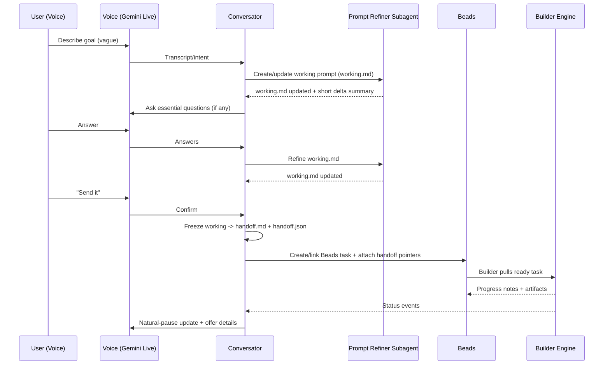
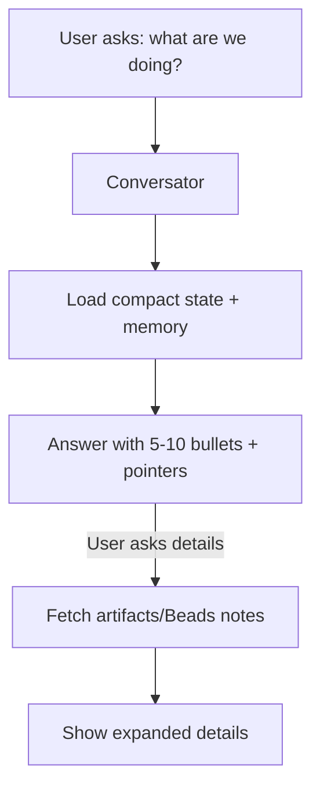

# Workflows

## Master workflow (voice → handoff → build → summarize)

## Prompt refinement loop

- Single mutable prompt file: `working.md`
- Each refinement overwrites file in place.
- Conversator shows **brief delta** to user (not full file).
- Freeze to handoff only when user confirms.

## Parallel planning & building

- Conversator can refine prompt A while builder works on task B.
- Conversator maintains:
  - inbox queue (batched updates)
  - “awaiting review/approval” list
  - “recently completed” list

## Status recall flow

## Research flow (optional)
- User asks: “Go research X”
- Conversator dispatches Researcher subagent
- Researcher returns:
  - key findings (bullets)
  - citations/links
  - recommended prompt adjustments
- Prompt Refiner incorporates findings into `working.md`
